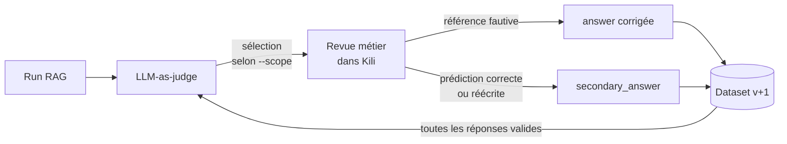

# Évaluation LLM (LLM_STATIC)

Comparer plusieurs sorties de modèles sur une même question. Ce type de
projet ne ressemble à aucun des précédents : l'asset n'est pas un
fichier mais une **conversation**.

Exemple de référence : `examples/10_llm_judge_ab_testing.py` —
révision métier d'un jeu d'évaluation RAG assurance auto.

## Le cas d'usage

On évalue un RAG en comparant sa prédiction à une réponse validée par
les métiers. Un LLM-as-judge tranche automatiquement, mais il est trop
sévère : il ne sait pas distinguer, dans la réponse de référence, ce qui
est **essentiel** de ce qui est **optionnel**.

À chaque nouveau benchmark, une sélection de cas part en revue pour
produire **la version suivante du dataset** :



Le métier répond à **deux questions indépendantes** — la référence
est-elle correcte ? la prédiction l'est-elle ? — et dispose de deux
champs libres optionnels pour corriger l'une ou enrichir l'autre.

!!! warning "Le verdict du juge ne s'affiche pas"
    Il sert uniquement à **sélectionner** les cas. L'afficher ferait
    perdre du temps aux annotateurs et les ancrerait sur l'avis qu'on
    cherche précisément à auditer. Il reste dans les `metadata`, d'où
    l'export tire les statistiques de désaccord juge / métier.

### Le périmètre de revue

`--scope` arbitre entre coût d'annotation et complétude de l'audit :

| `--scope` | Cas soumis | Ce qu'on voit — et ce qu'on rate |
| --- | --- | --- |
| `rejected` *(défaut)* | les rejets du juge | ses **faux négatifs** ; aveugle à ses faux positifs |
| `all` | toutes les questions | audit complet, coût proportionnel au benchmark |
| `sample` | les rejets + `--sample-size` cas validés | compromis : les faux positifs sous contrôle de coût |

Le tirage de `sample` est déterministe (graine fixe) : deux exécutions
soumettent le même échantillon.

## Créer le projet

```python
kili.create_project(
    title="Revision metier du jeu d'evaluation RAG",
    input_type="LLM_STATIC",
    json_interface=json_interface,
)
```

## json_interface : la clé `level`

Les jobs LLM portent une clé supplémentaire, `level`, qui indique à quel
endroit de la conversation ils s'appliquent :

| `level` | L'annotateur juge… |
| --- | --- |
| `completion` | **chaque réponse** séparément |
| `round` | **l'échange** : une question et ses réponses |
| `conversation` | l'échange **entier**, tous tours confondus |

*(Constantes relevées dans `kili_formats.types.JobLevel`, SDK 2.176.1.)*

```json
{
  "jobs": {
    "PREDICTION_CORRECTE": {
      "mlTask": "CLASSIFICATION",
      "content": {
        "categories": {
          "OUI": {"children": [], "name": "Oui — acceptable"},
          "NON": {"children": [], "name": "Non — inacceptable"}
        },
        "input": "radio"
      },
      "instruction": "La nouvelle réponse est-elle correcte ?",
      "level": "round",
      "required": 1,
      "isChild": false
    }
  }
}
```

L'interface de l'exemple 10 en compte quatre, tous au niveau `round` :

| Job | Type | Rôle |
| --- | --- | --- |
| `REFERENCE_CORRECTE` | radio, requis | la référence fait-elle autorité ? |
| `PREDICTION_CORRECTE` | radio, requis | la nouvelle réponse est-elle bonne ? |
| `REFERENCE_CORRIGEE` | texte, optionnel | remplace `answer` si la référence est fautive |
| `REPONSE_SECONDAIRE` | texte, optionnel | une formulation valide de plus |

Séparer les deux champs libres évite d'avoir à **deviner** à l'export où
va chaque texte saisi : leur destination est portée par le job lui-même.
Le second couvre le cas courant où la prédiction est *presque* bonne —
il lui manque une information, ou elle en ajoute une fausse : plutôt que
de la rejeter en bloc, le métier en écrit la version correcte.

Les `mlTask` acceptés en LLM_STATIC sont `CLASSIFICATION`,
`TRANSCRIPTION` et `COMPARISON` (comparaison par paire).

!!! tip "Constructeurs dédiés"
    `kili_examples.interfaces` fournit `build_llm_classification_job` et
    `build_llm_transcription_job`, identiques à leurs équivalents non-LLM
    mais avec le paramètre `level` obligatoire.

## Importer des conversations

`append_many_to_dataset` ne sait pas construire de `chatItems` : on
utilise une méthode dédiée.

```python
kili.llm.import_conversations(
    project_id=project_id,
    conversations=conversations,
)
```

Structure d'une conversation :

```python
{
    "externalId": "q-0001",
    "chatItems": [
        {
            "externalId": "q-0001-system",
            "role": "SYSTEM",
            "content": "Consigne de revue, variantes déjà acceptées…",
        },
        {
            "externalId": "q-0001-user",
            "role": "USER",
            "content": "Quel est le délai pour déclarer un sinistre ?",
        },
        {
            "externalId": "q-0001-reference",
            "role": "ASSISTANT",
            "content": "Vous disposez de 5 jours ouvrés…",
            "modelName": "reference-metier",     # requis pour ASSISTANT
        },
        {
            "externalId": "q-0001-prediction",
            "role": "ASSISTANT",
            "content": "Le délai est de 5 jours ouvrés.",
            "modelName": "rag-assurance-auto-v2",
        },
    ],
    "metadata": {"question_id": "q-0001", "judge_verdict": "NON_CONFORME"},
}
```

| Clé | Rôle |
| --- | --- |
| `externalId` | identifiant de la conversation, et de **chaque** chat item — doivent être uniques |
| `role` | `SYSTEM`, `USER` ou `ASSISTANT` |
| `modelName` | **requis** sur les items `ASSISTANT` ; s'affiche dans l'éditeur |
| `label` | pré-annotation optionnelle (voir plus bas) |
| `metadata` | dictionnaire libre, ressort à l'export |

!!! warning "Exactement deux ASSISTANT par tour"
    La documentation Kili impose deux réponses d'assistant par prompt
    utilisateur. Dans notre cas c'est un atout : la **réponse validée**
    et la **prédiction** forment naturellement la paire, et l'éditeur
    les affiche côte à côte.

!!! tip "Ce qu'on met — et ne met pas — dans le SYSTEM"
    Le chat item `SYSTEM` porte la consigne et le rappel des
    formulations déjà acceptées, qui évite de re-saisir une variante
    connue. Le verdict du juge, lui, reste dans `metadata` : visible du
    code, jamais de l'annotateur.

## Format des labels

Le label d'un projet LLM_STATIC ne ressemble pas au `jsonResponse` des
autres types. Trois différences :

1. il est indexé par **niveau** (`conversation`, `round`, `completion`)
   et non directement par nom de job ;
2. au niveau `round`, chaque job est indexé par le **numéro de tour**,
   sous forme de **chaîne** (`"0"` pour le premier) ;
   au niveau `completion`, par l'`externalId` du chat item ;
3. `categories` est une **liste de chaînes** — et non une liste de
   dictionnaires `{"name": …, "confidence": …}`.

```python
{
    "label": {
        "conversation": {
            "CLASSIFICATION_JOB_AT_CONVERSATION_LEVEL": {
                "categories": ["GLOBAL_GOOD"]
            }
        },
        "round": {
            "PREDICTION_CORRECTE": {
                "0": {"categories": ["OUI"]}
            },
            "REPONSE_SECONDAIRE": {
                "0": {"text": "Une autre formulation valide."}
            },
            "COMPARISON_JOB": {
                "0": {
                    "code": "IS_BETTER",
                    "firstId": "q-0001-reference",
                    "secondId": "q-0001-prediction",
                }
            },
        },
        "completion": {
            "CLASSIFICATION_JOB_AT_COMPLETION_LEVEL": {
                "q-0001-prediction": {"categories": ["TOO_SHORT"]}
            }
        },
    }
}
```

Un job `TRANSCRIPTION` répond sous la clé `text` là où un job
`CLASSIFICATION` répond sous `categories`.

### Pré-annoter — et surtout, savoir quoi ne pas pré-remplir

Le `label` se passe directement dans la conversation à l'import. Un seul
job est pré-rempli, et c'est un choix de conception :

```python
conversation["label"] = {
    "round": {"REFERENCE_CORRECTE": {"0": {"categories": ["OUI"]}}}
}
```

`REFERENCE_CORRECTE` arrive à `OUI` parce que la référence est validée
par les experts : la contredire doit rester l'exception. `PREDICTION_CORRECTE`,
lui, est **laissé vide** — le pré-remplir avec l'avis du juge
biaiserait l'annotateur vers cet avis, alors que tout l'objet du
dispositif est de le vérifier.

C'est aussi ce qui rend le champ exploitable comme marqueur : sa
présence à l'export prouve qu'un humain est passé, ce dont
`kili_examples.rag_review.is_reviewed` se sert pour ignorer les cas non
traités.

## Exporter

```python
conversations = kili.llm.export(project_id=project_id)
```

`kili.llm.export` renvoie les conversations avec leurs labels — et non
le format des autres exemples. Il accepte notamment `label_type_in` et
`status_in` pour ne récupérer que les cas effectivement traités.

La lecture des labels est encapsulée dans `kili_examples.rag_review`
(`extract_category`, `extract_text`), puis `build_enriched_answer_bank`
produit **deux sorties distinctes** :

| Fichier | Contenu |
| --- | --- |
| `answer_bank_enrichie.jsonl` | le nouveau dataset, au schéma **strictement identique** à l'entrée |
| `revision_report.json` | la traçabilité : corrections, promotions, désaccords |

Cette séparation est délibérée : le dataset reste relisible tel quel par
le juge, sans qu'il ait à tolérer des champs de provenance, et le
rapport peut s'enrichir sans jamais toucher aux données.

### Les règles de construction

| Situation | Effet sur le dataset |
| --- | --- |
| `REFERENCE_CORRECTE = NON` + texte saisi | `answer` est remplacée |
| `REFERENCE_CORRECTE = NON` sans texte | rien — signalé dans le rapport |
| `REPONSE_SECONDAIRE` renseignée | ajoutée aux `secondary_answers` |
| `PREDICTION_CORRECTE = OUI`, sans réécriture | la prédiction est promue telle quelle |

La réécriture manuelle **prime toujours** sur la prédiction brute, y
compris quand la prédiction a été jugée incorrecte : c'est exactement le
cas « presque bonne, je l'ai corrigée ».

L'opération est **idempotente** : rejouer un export n'ajoute jamais deux
fois la même variante, et aucune `secondary_answer` n'est obligatoire.

### Mesurer les erreurs du juge

Parce que `judge_verdict` a survécu dans `metadata`, le rapport croise
son avis avec celui du métier :

| | métier : correcte | métier : incorrecte |
| --- | --- | --- |
| **juge : rejette** | faux négatif du juge | accord |
| **juge : valide** | accord | faux positif du juge |

Les faux positifs ne sont mesurables qu'en `--scope all` ou `sample` :
en `rejected`, le juge n'a soumis que des rejets.

## Ce que ça remplace

| Excel | Kili |
| --- | --- |
| Un fichier par run, versionné à la main | Un projet, une file de travail |
| Pas de traçabilité de l'auteur | Auteur et date par annotation |
| Copier-coller des réponses | Affichage côte à côte natif |
| Promotion manuelle en `secondary_answer` | Export qui produit le dataset suivant |
| Correction d'une référence fautive noyée dans les commentaires | Champ dédié, appliqué automatiquement |
| Pas de mesure de la qualité du juge | Croisement juge / métier calculé à chaque run |
