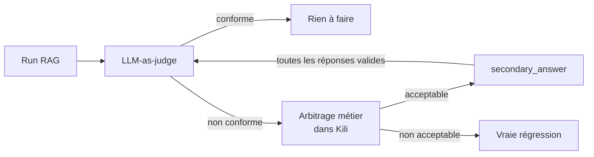

# Évaluation LLM (LLM_STATIC)

Comparer plusieurs sorties de modèles sur une même question. Ce type de
projet ne ressemble à aucun des précédents : l'asset n'est pas un
fichier mais une **conversation**.

Exemple de référence : `examples/10_llm_judge_ab_testing.py` —
arbitrage métier d'un LLM-as-judge sur un RAG assurance auto.

## Le cas d'usage

On évalue un RAG en comparant sa prédiction à une réponse validée par
les métiers. Un LLM-as-judge tranche automatiquement, mais il est trop
sévère : il ne sait pas distinguer, dans la réponse de référence, ce qui
est **essentiel** de ce qui est **optionnel**.

La boucle mise en place :



Seuls les cas **rejetés** par le juge remontent aux métiers : c'est ce
filtre qui rend la revue soutenable. Chaque prédiction validée par le
métier devient une `secondary_answer`, et le juge reçoit ensuite toutes
les formulations acceptables — ses faux négatifs diminuent run après
run.

## Créer le projet

```python
kili.create_project(
    title="Arbitrage metier du LLM-as-judge",
    input_type="LLM_STATIC",
    json_interface=json_interface,
)
```

## json_interface : la clé `level`

Les jobs LLM portent une clé supplémentaire, `level`, qui indique à quel
endroit de la conversation ils s'appliquent :

| `level` | L'annotateur juge… |
| --- | --- |
| `completion` | **chaque réponse** séparément |
| `round` | **l'échange** : une question et ses réponses |
| `conversation` | l'échange **entier**, tous tours confondus |

*(Constantes relevées dans `kili_formats.types.JobLevel`, SDK 2.176.1.)*

```json
{
  "jobs": {
    "VERDICT_METIER": {
      "mlTask": "CLASSIFICATION",
      "content": {
        "categories": {
          "ACCEPTABLE": {"children": [], "name": "Acceptable"},
          "NON_ACCEPTABLE": {"children": [], "name": "Non acceptable"}
        },
        "input": "radio"
      },
      "instruction": "La prédiction est-elle acceptable ?",
      "level": "round",
      "required": 1,
      "isChild": false
    }
  }
}
```

Les `mlTask` acceptés en LLM_STATIC sont `CLASSIFICATION`,
`TRANSCRIPTION` et `COMPARISON` (comparaison par paire).

!!! tip "Constructeurs dédiés"
    `kili_examples.interfaces` fournit `build_llm_classification_job` et
    `build_llm_transcription_job`, identiques à leurs équivalents non-LLM
    mais avec le paramètre `level` obligatoire.

## Importer des conversations

`append_many_to_dataset` ne sait pas construire de `chatItems` : on
utilise une méthode dédiée.

```python
kili.llm.import_conversations(
    project_id=project_id,
    conversations=conversations,
)
```

Structure d'une conversation :

```python
{
    "externalId": "q-0001",
    "chatItems": [
        {
            "externalId": "q-0001-system",
            "role": "SYSTEM",
            "content": "Contexte, verdict du juge, sa justification…",
        },
        {
            "externalId": "q-0001-user",
            "role": "USER",
            "content": "Quel est le délai pour déclarer un sinistre ?",
        },
        {
            "externalId": "q-0001-reference",
            "role": "ASSISTANT",
            "content": "Vous disposez de 5 jours ouvrés…",
            "modelName": "reference-metier",     # requis pour ASSISTANT
        },
        {
            "externalId": "q-0001-prediction",
            "role": "ASSISTANT",
            "content": "Le délai est de 5 jours ouvrés.",
            "modelName": "rag-assurance-auto-v2",
        },
    ],
    "metadata": {"question_id": "q-0001", "judge_verdict": "NON_CONFORME"},
}
```

| Clé | Rôle |
| --- | --- |
| `externalId` | identifiant de la conversation, et de **chaque** chat item — doivent être uniques |
| `role` | `SYSTEM`, `USER` ou `ASSISTANT` |
| `modelName` | **requis** sur les items `ASSISTANT` ; s'affiche dans l'éditeur |
| `label` | pré-annotation optionnelle (voir plus bas) |
| `metadata` | dictionnaire libre, ressort à l'export |

!!! warning "Exactement deux ASSISTANT par tour"
    La documentation Kili impose deux réponses d'assistant par prompt
    utilisateur. Dans notre cas c'est un atout : la **réponse validée**
    et la **prédiction** forment naturellement la paire, et l'éditeur
    les affiche côte à côte.

!!! tip "Mettre le contexte dans le SYSTEM"
    Le verdict du juge et sa justification sont placés dans le chat item
    `SYSTEM`. L'annotateur voit ainsi *pourquoi* le cas lui est soumis —
    ce que l'Excel ne permettait pas simplement.

## Format des labels

Le label d'un projet LLM_STATIC ne ressemble pas au `jsonResponse` des
autres types. Trois différences :

1. il est indexé par **niveau** (`conversation`, `round`, `completion`)
   et non directement par nom de job ;
2. au niveau `round`, chaque job est indexé par le **numéro de tour**,
   sous forme de **chaîne** (`"0"` pour le premier) ;
   au niveau `completion`, par l'`externalId` du chat item ;
3. `categories` est une **liste de chaînes** — et non une liste de
   dictionnaires `{"name": …, "confidence": …}`.

```python
{
    "label": {
        "conversation": {
            "CLASSIFICATION_JOB_AT_CONVERSATION_LEVEL": {
                "categories": ["GLOBAL_GOOD"]
            }
        },
        "round": {
            "VERDICT_METIER": {
                "0": {"categories": ["ACCEPTABLE"]}
            },
            "COMPARISON_JOB": {
                "0": {
                    "code": "IS_BETTER",
                    "firstId": "q-0001-reference",
                    "secondId": "q-0001-prediction",
                }
            },
        },
        "completion": {
            "CLASSIFICATION_JOB_AT_COMPLETION_LEVEL": {
                "q-0001-prediction": {"categories": ["TOO_SHORT"]}
            }
        },
    }
}
```

### Pré-annoter avec le verdict du juge

Le `label` se passe directement dans la conversation à l'import. On
pré-positionne le verdict du juge pour que le métier **arbitre** au lieu
de repartir d'un écran vide :

```python
conversation["label"] = {
    "round": {"VERDICT_METIER": {"0": {"categories": ["NON_ACCEPTABLE"]}}}
}
```

## Exporter

```python
conversations = kili.llm.export(project_id=project_id)
```

`kili.llm.export` renvoie les conversations avec leurs labels — et non
le format des autres exemples. Il accepte notamment `label_type_in` et
`status_in` pour ne récupérer que les cas effectivement traités.

La lecture d'un verdict est encapsulée dans
`kili_examples.rag_review.extract_business_verdict`, puis
`build_enriched_answer_bank` produit la banque de réponses enrichie.
Cette dernière est **idempotente** : rejouer un export n'ajoute jamais
deux fois la même variante.

## Ce que ça remplace

| Excel | Kili |
| --- | --- |
| Un fichier par run, versionné à la main | Un projet, une file de travail |
| Pas de traçabilité de l'auteur | Auteur et date par annotation |
| Copier-coller des réponses | Affichage côte à côte natif |
| Promotion manuelle en `secondary_answer` | Export qui produit la banque enrichie |
| Pas de motif d'écart exploitable | `MOTIF_ECART` structuré, réutilisable pour corriger le prompt du juge |

Le job `MOTIF_ECART` mérite une attention particulière : en agrégeant
les motifs sur plusieurs runs, on sait si le juge échoue surtout sur des
« informations optionnelles » (→ corriger son prompt) ou sur de vraies
régressions (→ corriger le RAG).
